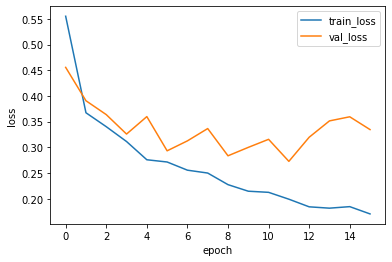
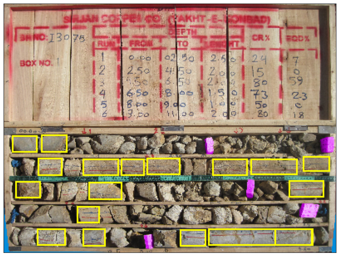
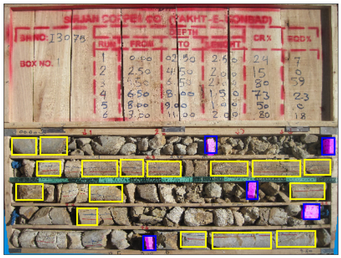
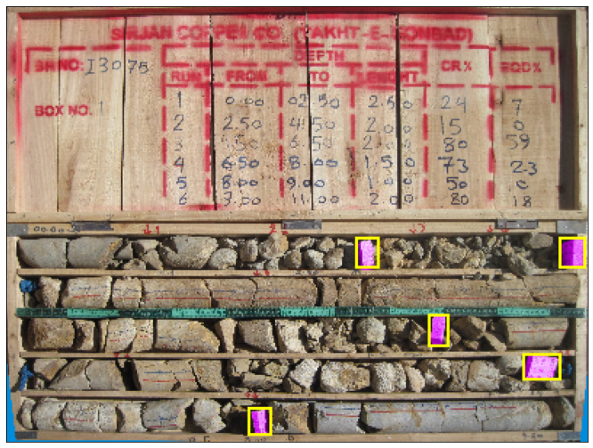

<p align="center">
  <a href="" rel="noopener">
 <!-- </a> -->
 </a>
</p>

<h1 align="center">Quera Mine Competition</h1>

<!-- <div align="center"> -->

<!-- []()
[](https://github.com/kylelobo/The-Documentation-Compendium/issues)
[](https://github.com/kylelobo/The-Documentation-Compendium/pulls)
[](/LICENSE) -->

<!-- </div> -->

<!-- --- -->

<p align="center"> My solution for the object detection problem of the Quera Mine Competition
    <br> 
</p>

## 📝 Table of Contents

- [About](#about)
- [Getting Started](#getting_started)
- [Dataset](#dataset)
- [Metric](#metric)
- [Prediction](#prediction)
- [My Solution](#my_solution)
- [How to Use](#how_to_use)
- [Project Structure](#project_structure)


## 🧐 About <a name = "about"></a>

The competition revolves around the calculation of rock lengths in a mineral exploration process. You can find the competition information in the table below.

<div align="center">

 Contest | Date | Scoreboard 
:-------:|:-------:|:----:
 [**Mine Problem**](https://quera.ir/contest/assignments/31720/problems) | August 24, 2021 | 18/150 [Link](https://quera.ir/contest/assignments/31720/scoreboard)
</div>

A [notebook](notebooks/notebook.ipynb) file is available for use on Google Colab. Below is the description of the contest organizer regarding the dataset and metric:

## 🏁 Getting Started <a name = "getting_started"></a>

Each box picture contains rock pieces that are labeled if they are larger than 10 cm and wood pieces. For instance, the figure below shows only one example of each type of labeled object using white rectangles.


Furthermore, the figure below displays the given parameters for an identified object:


The objects (woods and rocks) in the samples in the train folder are labeled for you in the label.xlsx file with the following specifications:

<div align="center">

Column name       | Description 
:----------------- | :-----------------:
image_name     | ID of a photo (box) 
label_name	  | The name of the detected object 
xmin	  |  x coordinate of the upper-left corner of the object rectangle 
ymin    | y coordinate of the upper-left corner of the object rectangle 
width   | Length of object rectangle (in x axis) 
height   | Height of object rectangle (on y axis) 
image_width   | Image width in pixels 
image_height   | Image height in pixels 
</div>

Each run is separated by a vertical wood pieces placed in the core box.<br />

The Rock Quality Designation, abbreviated as RQD, is an approximate measure to determine the number of fractures in the rock mass. This "percentage criterion" is calculated as follows for each Run:<br />


For instance, in the first run of this box, there are only two rocks larger than 10 cm that are marked in the figure (the first row of cores), and the wood marking the end of the run is also shown. Run number one starts from the first row of the box (left side) and continues to the first wood of the same row. Given that the length of this run is 2.5 meters and the total length of the labeled rocks is 0.2 meters, its RQD value is 8% according to the following calculations:

<div align="center">

$$ RQD=100\times \tfrac{0.2}{2.5}=8\\% $$
</div>


As per Chapter 8 of the [Mineral Exploration Book](https://www.elsevier.com/books/mineral-exploration/haldar/978-0-12-814022-2), the RQD group for a run is calculated according to the following table:

<div align="center">

RQD percent range | class 
:-----------------: | :-----:
[0,25]     | 1 
[25,50)	  | 2 
[50,75)	  | 3 
[75,90)    | 4 
[90,100)   | 5 
</div>

For instance, for the run described above that had an RQD value of 8%, the RQD group would be set to 1.<br />
The length of the box of cores in all photos is 1.1 meters along the x-axis. All the woods are colored purple to simplify the image. You can assume that if you are given a new image to identify the RQD, the woods must have been colored purple by someone.

## 🏁 Dataset <a name = "dataset"></a>

The training dataset is located in the train folder, and the test dataset is located in the test-rqd folder.
You should read the depth of a run for the test dataset from the from-to-rqd.xlsx file and then calculate the RQD group of that run. This Excel file has the following specifications:

<div align="center">

Column name       | Description 
:----------------- | :-----------------:
RunId     |  ID of a Run
From	  | the From value of that Run in meters
To	  |  The To value of that Run in meters
</div>

A RunId is defined based on the structure "mineName-boreholeName-photoNumber-runNumber". Note that "photoNumber" and "runNumber" for each borehole start from 1.<br />
For example, a RunId can be M3-BH130-1-3, which indicates the ID of the M3 mine, the ID of the borehole BH130, the first image of that borehole, and the run number 3 of that image.


## 🔧 Metric <a name = "metric"></a>

The accuracy criterion is used to evaluate the result of your work in declaring the RQD group of each run.

<div align="center">

$$ Accuracy=\tfrac{Number of RunIds}{Number  of  correctly  identified  RQD  groups} $$
</div>

The result of this criterion on the test data is multiplied by 1000 and is considered as the score of this stage (the highest possible score of this stage is 1000, and the lowest possible score is zero).

The judging of this question before the end of the competition will be based on only 30% of the test data. After the competition, 100% of the test data will be used for the final update of the scoreboard; This is done to avoid overfitting on the test data.

## 🚀 Prediction <a name = "prediction"></a>

Write your model predictions on the test dataset (test-rqd folder of test dataset samples) in a file called output.csv. This file should have two columns named RunId and Prediction respectively. In each row, put the RunId and your prediction of the RQD group corresponding to that run in the Prediction column (note that the CSV file must have a header). After preparing the output.csv file, upload it to us.


## ⛏️ My Solution <a name = "my_solution"></a>
Since the competition is about object detection, so I have used Faster R-CNN architucture, which can accurately and quickly predict the locations of different objects. Also, A [notebook](notebooks/notebook.ipynb) file is available for use on Google Colab.
Two separate Faster R-CNN models are used to identify rocks and woods. The following settings have also been used for modeling: <br />

- **Hyperparameter**: I used hyperOpt to optimize these parameters, Learning rate, momentum, weight_decay, and batch size.
These are my space for both models:

```python
space={'lr' : hp.uniform('lr', 0,0.01),
        'momentum' : hp.uniform('momentum', 0.85,0.99),
        'weight_decay': hp.uniform('weight_decay', 0,0.01),
        'batch_size': hp.choice('batch_size', [1,2,4,8]),
       }
```

and optimized solutions: 

```python
rock_model_hyperparameters: {'batch_size' : 8, 'lr': 0.008388406010734754, 'momentum': 0.9444939643124248, 'weight_decay': 0.007445852010334835}

wood_model_hyperparameters: {'batch_size' : 8, 'lr': 0.006039497039954175, 'momentum': 0.9708223564790668, 'weight_decay': 0.0014905031197396778}

```

- **Early Stopping**: with  ```patience=4``` and  ```min_delta=0.01```
- **Dataset**: I used ```15%``` of dataset for validation and ```85%``` for training, and there are ```156``` samples.
- **Augmentation and Transforms**: following transforms and augmentations are used.

```python
both_models_augmentation: RandomHorizontalFlip(0.5)

tranform_rock = transforms.Compose([transforms.Normalize(mean=[0.485, 0.456, 0.406],std=[0.229, 0.224, 0.225]),
                                   transforms.Grayscale(num_output_channels=1)
                                    ])
tranform_wood = []

```
- **Learning**: I used epoch=40 with early stoping. The learning curves of both models are shown below:.

<div align="center">

<em>training curve</em>

 | 
:-------: | :-------:
<em>the rock model</em>|<em>the wood model</em>
</div>

- **Prediction**: I applied the wood and rock models to a sample from the validation dataset, and the output is shown below:

<div align="center">

<em>Output of the rock model applied to a sample of validation dataset</em>

 | 
:-------: | :-------:
<em>Predicted Bounding Boxes</em>|<em>Target Bounding Boxes</em>
</div>


<div align="center">

<em>Output of the wood model applied to a sample of validation dataset</em>

 | 
:-------: | :-------:
<em>Predicted Bounding Boxes</em>|<em>Target Bounding Boxes</em>
</div>

## 🎈 How to Use <a name = "how_to_use"></a>

These instructions will help you get a copy of the project up and running on Google Colab. Also, A [notebook](notebooks/notebook.ipynb) file is available for use on Google Colab.
The project works with ```python 3.9.16``` and packages with version specified in the ```requirements.txt```

### 🎈 Clone the Project

You should clone project and change cwd to the project directory.

```
!git clone https://github.com/BAfsharmanesh/quera_mine_problem.git
%cd /content/quera_mine_problem
```

### 🎈 Dataset

You can use following instructions to make a copy of dataset from original dataset.

- Copy dataset to you google drive from following link:

```
https://drive.google.com/file/d/1fSzUMCJHx3JHwrDpY_Qz6KI1zIUv3BnC/edit
```

- You can make a copy of the dataset from Google Drive to Colab using following command.

```
from google.colab import drive
from google.colab import files
drive.mount('/content/drive')

!cp /content/drive/MyDrive/data.zip data/data.zip
!unzip -qq data/data.zip -d data/
!rm data/data.zip
```

### 🎈 Load data and Split valid-train dataset

```
from src.dataset import Dataset_from_memory, valid_train_split
from src.utils import img_tensor_load
import pandas as pd
import os
import torchvision.transforms as transforms
```

```
img_path = 'data/train/'
label_path = 'data/label.xlsx'

dir_name = sorted(os.listdir(img_path))

labels = pd.read_excel(label_path)

df2 = pd.DataFrame(data=[file_nm.split('.')[0].split('-') for file_nm in dir_name], columns=['Mine', 'Borehole', 'Box_num'])
df2['File'] = dir_name


all_img_tensor = img_tensor_load(img_path, df2, transform=transforms.Resize((300,400)))

targets_dict_list = []
for i in range(len(all_img_tensor)):
    d = {}
    boxes_img, labels_img, _ , _ = boxs_labels_fun(all_img_tensor[i], df2.File[i], labels)
    d['boxes'] = boxes_img
    d['labels'] = labels_img
    targets_dict_list.append(d)

train_indx, valid_indx = valid_train_split(sample_len=len(targets_dict_list), valid_percent=15)
```

### 🎈 Hyperparameter Optimization

```
from src.hyperparameters import hyperopt_fmin
```
- rock hyperparameter optimization 
```
targets_dict_list_rock = [{'boxes': t['boxes'][t['labels'] == 1], 'labels': t['labels'][t['labels'] == 1]} for t in targets_dict_list]

inputData = [targets_dict_list_rock, all_img_tensor, train_indx, valid_indx]
best_hyperparams, trials = hyperopt_fmin(inputData)
```
- wood hyperparameter optimization 
```
targets_dict_list_wood = [{'boxes': t['boxes'][t['labels'] == 0], 'labels': t['labels'][t['labels'] == 0]+1} for t in targets_dict_list]

inputData = [targets_dict_list_wood, all_img_tensor, train_indx, valid_indx]
best_hyperparams, trials = hyperopt_fmin(inputData)
```

### 🎈 Train

```
from src.train import train_valid_setup, training_plot
```

- rock model
```
train_loss_rock, valid_loss_rock = train_valid_setup(lr=0.008388406010734754, 
                                          momentum=0.9444939643124248, 
                                          weight_decay=0.007445852010334835, 
                                          batch_size=8, 
                                          num_epochs=40,
                                          train_indx=train_indx, 
                                          valid_indx=valid_indx, 
                                          all_img_tensor=all_img_tensor, 
                                          targets_dict_list=targets_dict_list_rock,
                                          num_classes=2,
                                          modelType={'name':'rock','max':0.75,'patience':4, 'imgT':True})
```

- wood model

```
train_loss_wood, valid_loss_wood = train_valid_setup(lr=0.006039497039954175, 
                                          momentum=0.9708223564790668, 
                                          weight_decay=0.0014905031197396778, 
                                          batch_size=8, 
                                          num_epochs=40,
                                          train_indx=train_indx, 
                                          valid_indx=valid_indx, 
                                          all_img_tensor=all_img_tensor, 
                                          targets_dict_list=targets_dict_list_wood,
                                          num_classes=2,
                                          modelType={'name':'wood','max':0.30,'patience':4, 'imgT':False})
```

- plot traning curve

```
training_plot(train_loss_rock, valid_loss_rock)

training_plot(train_loss_wood, valid_loss_wood)
```

- copy models to the Google drive

```
!cp /content/quera_mine_problem/models/checkPoint_rock_model.pth /content/drive/MyDrive
!cp /content/quera_mine_problem/models/checkPoint_wood_model.pth /content/drive/MyDrive

```

### 🎈 Inference on validation dataset


```
from src.utils import load_weights_fun, imgs_with_boxes, show
from src.model import model_select
from src.train import img_transform
from torchvision.transforms.functional import convert_image_dtype
```

```
## rock model
model_rock, optimizer_rock, device = model_select(lr=0.008388406010734754, 
                                          momentum=0.9444939643124248, 
                                          weight_decay=0.007445852010334835, 
                                        num_classes=2)
load_weights_fun('/content/quera_mine_problem/models/checkPoint_rock_model.pth', model_rock, optimizer_rock)

img_rock = img_transform()(convert_image_dtype(all_img_tensor[valid_indx], dtype=torch.float32))

model_rock = model_rock.eval()
outputs_rock = model_rock(img_rock.to(device))

## wood model
model_wood, optimizer_wood, device = model_select(lr=0.006039497039954175, 
                                        momentum=0.9708223564790668, 
                                        weight_decay=0.0014905031197396778, 
                                        num_classes=2)
load_weights_fun('/content/quera_mine_problem/models/checkPoint_wood_model.pth', model_wood, optimizer_wood)

img_wood = img_transform()(convert_image_dtype(all_img_tensor[valid_indx], dtype=torch.float32))

model_wood = model_wood.eval()
outputs_wood = model_wood(img_wood.to(device))

```

```
imgs_with_boxes_pred_rock = imgs_with_boxes(all_img_tensor[valid_indx], 
                                       outputs_rock, 
                                       score_threshold=0.8, 
                                       pred=True)
imgs_with_boxes_true_rock = imgs_with_boxes(all_img_tensor[valid_indx],
                                       [targets_dict_list_rock[i] for i in valid_indx], 
                                       score_threshold=0.8, 
                                       pred=False)
imgs_with_boxes_pred_wood = imgs_with_boxes(all_img_tensor[valid_indx], 
                                       outputs_wood, 
                                       score_threshold=0.8, 
                                       pred=True)
imgs_with_boxes_true_wood = imgs_with_boxes(all_img_tensor[valid_indx],
                                       [targets_dict_list_wood[i] for i in valid_indx], 
                                       score_threshold=0.8, 
                                       pred=False)                                       
```

```
sample_num = 0
show(imgs_with_boxes_pred_rock[sample_num])
show(imgs_with_boxes_true_rock[sample_num])
show(imgs_with_boxes_pred_wood[sample_num])
show(imgs_with_boxes_true_wood[sample_num])
```

### 🎈 Inference on test dataset, Submission

- import modules
```
from src.postprocessing import inference_test_data, calculate_sub

```

- load data

```
img_test_path = 'data/test-rqd/'
run_depth_path = 'data/from-to-rqd.xlsx'

# Detect devices
use_cuda = torch.cuda.is_available()                   # check if GPU exists
device = torch.device("cuda" if use_cuda else "cpu")   # use CPU or GPU
print(device)

dir_name_test = sorted(os.listdir(img_test_path))

df2_test = pd.DataFrame(data=[file_nm.split('.')[0].split('-') for file_nm in dir_name_test], columns=['Mine', 'Borehole', 'Box_num'])
df2_test['File'] = dir_name_test

all_img_tensor_test = img_tensor_load(img_test_path, df2_test, transform=transforms.Resize((300,400)))

df = pd.read_excel(run_depth_path)
df['File'] = ['-'.join(i.split('-')[:-1])+'.jpg' for i in df.RunId]
```
- make prediction
```
output_rock_list, output_wood_list = inference_test_data(all_img_tensor_test, 
                                                        device,
                                                        rock_model_path='/content/drive/MyDrive/checkPoint_rock_model.pth', 
                                                        wood_model_path='/content/drive/MyDrive/checkPoint_wood_model.pth', 
                                                        score_threshold=0.8, 
                                                        box_iou_threshold=0.1)
```
- show prediction results
```
sample_num = 12

outputs = []
for i, j in zip(output_wood_list, output_rock_list):
  outputs.append( {'boxes':torch.cat([i,j]), 'labels':[0 for jj in range(len(i))] + [1 for jj in range(len(j))]} )

img_with_boxes_pred = imgs_with_boxes(all_img_tensor_test, 
                                       outputs, 
                                       score_threshold=0.8, 
                                       pred=False)

show(img_with_boxes_pred[sample_num])
```                                                                                               

- create output.csv

```
runs_dep_dict = df.groupby('File').apply(lambda g: list(100*(g['to'] - g['from']).values) ).to_dict()
runs_dep_list = [runs_dep_dict[i] for i in df2_test.File.to_list()]

sub = calculate_sub(output_rock_list, output_wood_list, runs_dep_list, df2_test, device)
```


## ✍️ Project Structure <a name = "project_structure"></a>
```
├──  data  
│    └── test-rqd            - here's the datasets folder for test.
│    └── train               - here's the datasets folder for train.
│    └── from-to-rqd.xlsx    - here's the file to calculated depth of each run.
│    └── label.xlsx          - here's the file that contains information of bounding boxes and labels.
│
│
├──  models
│   ├── checkPoint_rock_model.pth     - this file contains the checkPoint of rock mode.
│   └── checkPoint_wood_model.pth     - this file contains the checkPoint of wood mode.
│
│
├──  src
│   ├── dataset.py             - here's the file to make dataset and load data to memory.
│   ├── hyperparameters.py     - this file contains the hyperparameters optimization process.
│   ├── model.py               - this file contains the models of the project.
│   ├── postprocessing.py      - this file contains the inference process.
│   ├── train.py               - this file contains the train process.
│   └── utils.py               - this file contains all helpful functions and methods.
│
│
├──  docs                      - this folder contains images for ReadMe.me.
│   └── *.jpg/png     
│
│
└── notebooks              
    └── notebook.ipynb         - this notebook uses all methods to run on Colab.

