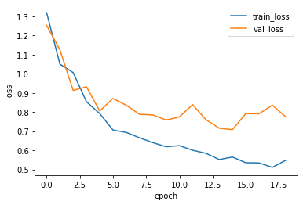

<p align="center">
  <a href="" rel="noopener">
 <!-- </a> -->
 </a>
</p>

<h1 align="center">Quera Mine Competition</h1>

<div align="center">

[]()
[](https://github.com/kylelobo/The-Documentation-Compendium/issues)
[](https://github.com/kylelobo/The-Documentation-Compendium/pulls)
[](/LICENSE)

</div>

---

<p align="center"> My solution for the object detection problem of the Quera Mine Competition
    <br> 
</p>

## 📝 Table of Contents

- [About](#about)
- [Getting Started](#getting_started)
- [Dataset](#dataset)
- [Metric](#metric)
- [Prediction](#prediction)
- [My Solution](my_solution)
- [How to Use](how_to_use)
- [Project Structure](project_structure)


## 🧐 About <a name = "about"></a>

The competition is about calculating the length of rocks in a  mineral exploration process. 

<center>

 Contest | Date | Scoreboard 
:-------:|:-------:|:----:
 [**Mine Problem**](https://quera.ir/contest/assignments/31720/problems) | August 24, 2021 | 18/150 [Link](https://quera.ir/contest/assignments/31720/scoreboard)

</center>


Below is the description of the contest organizer about the dataset and metric:

## 🏁 Getting Started <a name = "getting_started"></a>

Each picture box has rock pieces (labeled if it is larger than 10 cm) and wood pieces. For example, in the figure below, only one example of each type of labeled object is shown using white rectangles.


Also, in the figure below, the given parameters for an identified object are shown:


These objects for the photos in the train folder are labeled for you in the label.xlsx file with the following specifications:

<center>

Column name       | Description 
:----------------- | :-----------------:
image_name     | ID of a photo (box) 
label_name	  | The name of the detected object 
xmin	  |  x coordinate of the upper-left corner of the object rectangle 
ymin    | y coordinate of the upper-left corner of the object rectangle 
width   | Length of object rectangle (in x axis) 
height   | Height of object rectangle (on y axis) 
image_width   | Image width in pixels 
image_height   | Image height in pixels 

</center>


Each Run is separated by woods placed vertically in the core box.<br />

The Rock Quality Designation, abbreviated as RQD, is an approximate measure to determine the number of fractures in the rock mass. This "percentage criterion" is calculated as follows for each Run:<br />


For example, in the figure below for the first Run of this box, there are only two stones larger than 10 cm that are marked in the figure (the first row of cores), and the wood marking the end of the Run is also shown. Run number one starts from the first row of the box (left side) and continues to the first stick of the same row. Given that the length of this run is 2.5 meters and the total length of the labeled stones is 0.2 meters. Its RQD value is 8% according to the following calculations:

<center>

$ RQD=100\times \tfrac{0.2}{2.5}= \%8 $

</center>


According to Chapter 8 of Mineral Exploration Book, the RQD group for a Run is calculated according to the following table:

<center>

RQD percent range | class 
:-----------------: | :-----:
[0,25]     | 1 
[25,50)	  | 2 
[50,75)	  | 3 
[75,90)    | 4 
[90,100)   | 5 

</center>

For example, for the Run described above that had an RQD value of 8, the RQD group would be set to 1.

The length (x-axis) of boxe of cores in all photos is 1.1 meters.
All the woods are colored purple in order to simplify this match, and you can assume that if you are given a new photo to identify the RQD, the sticks must have been colored purple by someone.

## 🏁 Dataset <a name = "dataset"></a>

For this question, the training data is in the train folder and the test data is in the test-rqd folder. You have access to both of these folders in the new job step data.

You should read the length of a Run from test-rqd data from the from-to-rqd.xlsx file and then calculate the RQD group of that Run. This Excel file has the following specifications:

<center>

Column name       | Description 
:----------------- | :-----------------:
RunId     |  ID of a Run
From	  | the From value of that Run in meters
To	  |  The To value of that Run in meters

</center>

 

A RunId is defined based on the structure "Run Number-Photo Number-Specific Name-Miner Name". Note that the "Photo number" for each borehole starts from 1 and also the "Run number" for each photo starts from 1. 

For example, a RunId can be M3-BH130-1-3, which indicates the ID of the M3 mine, the ID of the borehole BH130, the first photo of that borehole and the Run number 3 of that photo.


## 🔧 Metric <a name = "metric"></a>

To evaluate the result of your work, the accuracy criterion is used in declaring the RQD group of each Run.

<center>

$ accuracy=\tfrac{Number of RunIds}{Number  of  correctly  identified  RQD  groups} $

</center>

The result of this criterion on the test data is multiplied by 1000 and is considered as the score of this stage (the highest possible score of this stage is 1000 and the lowest possible score is zero).

The judging of this question before the end of the competition will be based on only 30% of the test data. After the competition, 100% of the test data will be used for the final update of the scoreboard; This is done to avoid overfitting on the test data.

## 🚀 Prediction <a name = "prediction"></a>

Put your model predictions on the test data (test-rqd folder photos) in a file called output.csv. This file should have two columns named RunId and Prediction respectively. In each row, put the Run ID in RunId and your prediction of the RQD group corresponding to that Run in the Prediction column (note that the CSV file must have a header). After preparing the output.csv file, upload it to us.


## ⛏️ My Solution <a name = "my_solution"></a>
Since the competition is about object detection, so I have used Faster R-CNN architucture, which can accurately and quickly predict the locations of different objects. Two separate Faster R-CNN models are used to identify rocks and woods. The following settings have also been used for modeling: <br />
- **Hyperparameter**: I used hyperOpt to optimize the these parameters, Lrearning rate, momentum, weight_decay, and batch size.
These are my space for both models:

```
space={'lr' : hp.uniform('lr', 0,0.01),
        'momentum' : hp.uniform('momentum', 0.85,0.99),
        'weight_decay': hp.uniform('weight_decay', 0,0.01),
        'batch_size': hp.choice('batch_size', [1,2,4,8]),
       }
```

and optimized solutions: 

```
rock_model_hyperparameters: {'batch_size' : 8, 'lr': 0.008388406010734754, 'momentum': 0.9444939643124248, 'weight_decay': 0.007445852010334835}

wood_model_hyperparameters: {'batch_size' : 8, 'lr': 0.006039497039954175, 'momentum': 0.9708223564790668, 'weight_decay': 0.0014905031197396778}

```

- **Early Stopping**: with  ```patience=4``` and  ```min_delta=0.01```
- **Dataset**: I used ```15%``` of dataset for valid and ```85%``` for train, and there are ```156``` samples.
- **Augmentation and Transforms**: following transforms and augmentations are used.

```
both_models_augmentation: RandomHorizontalFlip(0.5)

tranform_rock = transforms.Compose([transforms.Normalize(mean=[0.485, 0.456, 0.406],std=[0.229, 0.224, 0.225]),
                                   transforms.Grayscale(num_output_channels=1)
                                    ])
tranform_wood = []

```
- **Learning**: I used epoch=40 with early stoping. Learning curve of both models are depicted follow.

<center>

<em>training curve</em>

 | 
:-------: | :-------:
<em>the rock model</em>|<em>the wood model</em>

</center>

- **Prediction**: I applied wood and rock models on a sample from vali set and results are as follow:

<center>

<em>a valid sample of rock model</em>

 | 
:-------: | :-------:
<em>predicted</em>|<em>original sample</em>

</center>

<center>

<em>a valid sample of wood model</em>

 | 
:-------: | :-------:
<em>predicted</em>|<em>original sample</em>

</center>

## 🎈 How to Use <a name = "how_to_use"></a>

These instructions will get you a copy of the project up and running on Colab machines.

### 🎈 Requirements 

You can use requirements.txt file to install all project dependencies.

```
!pip install -r requirements.txt
```

### 🎈 Dataset

you can use following instructions to make a copy of dataset from original dataset.

- copy dataset to you google drive from following link:

```
https://drive.google.com/file/d/1fSzUMCJHx3JHwrDpY_Qz6KI1zIUv3BnC/edit
```

- using following command to make a copy to Colab

```
from google.colab import drive
from google.colab import files
drive.mount('/content/drive')

!cp /content/drive/MyDrive/data.zip /content/data.zip
!unzip -qq /content/data.zip -d /content/data/
!rm /content/data.zip
```

### 🎈 Load data and Split valid-train dataset

```
from dataset import Dataset_from_memory, valid_train_split
```

```
data_path = '/content/data/'
img_path = data_path+'train/'
dir_name = sorted(os.listdir(img_path))

labels = pd.read_excel(data_path+'label.xlsx')

df2 = pd.DataFrame(data=[file_nm.split('.')[0].split('-') for file_nm in dir_name], columns=['Mine', 'Borehole', 'Box_num'])
df2['File'] = dir_name


all_img_tensor = img_tensor_load(img_path, df2, transform=transforms.Resize((300,400)))
train_indx, valid_indx = valid_train_split(sample_len=len(targets_dict_list), valid_percent=15)


targets_dict_list = []
for i in range(len(all_img_tensor)):
    d = {}
    boxes_img, labels_img, _ , _ = boxs_labels_fun(all_img_tensor[i], df2.File[i], labels)
    d['boxes'] = boxes_img
    d['labels'] = labels_img
    targets_dict_list.append(d)
```

### 🎈 Hyperparameter Optimization

```
from hyperparameters import hyperopt_fmin
```
- rock hyperparameter optimization 
```
targets_dict_list_rock = [{'boxes': t['boxes'][t['labels'] == 1], 'labels': t['labels'][t['labels'] == 1]} for t in targets_dict_list]

inputData = [targets_dict_list_rock, all_img_tensor, train_indx, valid_indx]
best_hyperparams, trials = hyperopt_fmin(inputData)
```
- wood hyperparameter optimization 
```
targets_dict_list_wood = [{'boxes': t['boxes'][t['labels'] == 0], 'labels': t['labels'][t['labels'] == 0]+1} for t in targets_dict_list]

inputData = [targets_dict_list_wood, all_img_tensor, train_indx, valid_indx]
best_hyperparams, trials = hyperopt_fmin(inputData)
```

### 🎈 Train

```
from train import train_valid_setup, training_plot
```

- rock model
```
train_loss_rock, valid_loss_rock = train_valid_setup(lr=0.008388406010734754, 
                                          momentum=0.9444939643124248, 
                                          weight_decay=0.007445852010334835, 
                                          batch_size=8, 
                                          num_epochs=40,
                                          train_indx=train_indx, 
                                          valid_indx=valid_indx, 
                                          all_img_tensor=all_img_tensor, 
                                          targets_dict_list=targets_dict_list_rock,
                                          num_classes=2,
                                          modelType={'name':'rock','max':0.75,'patience':4, 'imgT':True})
```

- wood model

```
train_loss_wood, valid_loss_wood = train_valid_setup(lr=0.006039497039954175, 
                                          momentum=0.9708223564790668, 
                                          weight_decay=0.0014905031197396778, 
                                          batch_size=8, 
                                          num_epochs=40,
                                          train_indx=train_indx, 
                                          valid_indx=valid_indx, 
                                          all_img_tensor=all_img_tensor, 
                                          targets_dict_list=targets_dict_list_wood,
                                          num_classes=2,
                                          modelType={'name':'wood','max':0.30,'patience':4, 'imgT':False})
```

- plot traning curve

```
training_plot(train_loss_rock, valid_loss_rock)

training_plot(train_loss_wood, valid_loss_wood)
```

- copy models to google drive

```
!cp /content/checkPoint_rock_model.pth /content/drive/MyDrive
!cp /content/checkPoint_wood_model.pth /content/drive/MyDrive

```

### 🎈 Inference on valid dataset


```
from utils import load_weights_fun, imgs_with_boxes, show
from model import model_select
from train import img_transform
from torchvision.transforms.functional import convert_image_dtype
```

```
## rock model
model_rock, optimizer_rock, device = model_select(lr=0.008388406010734754, 
                                          momentum=0.9444939643124248, 
                                          weight_decay=0.007445852010334835, 
                                        num_classes=2)
load_weights_fun('/content/drive/MyDrive/checkPoint_rock_model.pth', model_rock, optimizer_rock)

img_rock = img_transform()(convert_image_dtype(all_img_tensor[valid_indx], dtype=torch.float32))

model_rock = model_rock.eval()
outputs_rock = model_rock(img_rock.to(device))

## wood model
model_wood, optimizer_wood, device = model_select(lr=0.006039497039954175, 
                                        momentum=0.9708223564790668, 
                                        weight_decay=0.0014905031197396778, 
                                        num_classes=2)
load_weights_fun('/content/drive/MyDrive/checkPoint_wood_model.pth', model_wood, optimizer_wood)

img_wood = img_transform()(convert_image_dtype(all_img_tensor[valid_indx], dtype=torch.float32))

model_wood = model_wood.eval()
outputs_wood = model_wood(img_wood.to(device))

```

```
imgs_with_boxes_pred_rock = imgs_with_boxes(all_img_tensor[valid_indx], 
                                       outputs_rock, 
                                       score_threshold=0.8, 
                                       pred=True)
imgs_with_boxes_true_rock = imgs_with_boxes(all_img_tensor[valid_indx],
                                       [targets_dict_list_rock[i] for i in valid_indx], 
                                       score_threshold=0.8, 
                                       pred=False)
imgs_with_boxes_pred_wood = imgs_with_boxes(all_img_tensor[valid_indx], 
                                       outputs_wood, 
                                       score_threshold=0.8, 
                                       pred=True)
imgs_with_boxes_true_wood = imgs_with_boxes(all_img_tensor[valid_indx],
                                       [targets_dict_list_wood[i] for i in valid_indx], 
                                       score_threshold=0.8, 
                                       pred=False)                                       
```

```
sample_num = 0
show(imgs_with_boxes_pred_rock[sample_num])
show(imgs_with_boxes_true_rock[sample_num])
show(imgs_with_boxes_pred_wood[sample_num])
show(imgs_with_boxes_true_wood[sample_num])
```

### 🎈 Inference on test dataset, Submision

- import modules
```
from postprocessing import inference_test_data, calculate_sub

```

- load data

```
# Detect devices
use_cuda = torch.cuda.is_available()                   # check if GPU exists
device = torch.device("cuda" if use_cuda else "cpu")   # use CPU or GPU
print(device)

data_path_test = '/content/data/test-rqd/'
dir_name_test = sorted(os.listdir(data_path_test))

df2_test = pd.DataFrame(data=[file_nm.split('.')[0].split('-') for file_nm in dir_name_test], columns=['Mine', 'Borehole', 'Box_num'])
df2_test['File'] = dir_name_test

all_img_tensor_test = img_tensor_load(data_path_test, df2_test, transform=transforms.Resize((300,400)))

df = pd.read_excel(data_path+'from-to-rqd.xlsx')
df['File'] = ['-'.join(i.split('-')[:-1])+'.jpg' for i in df.RunId]
```
- make prediction
```
output_rock_list, output_wood_list = inference_test_data(all_img_tensor_test, 
                                                        device,
                                                        rock_model_path='/content/drive/MyDrive/checkPoint_rock_model.pth', 
                                                        wood_model_path='/content/drive/MyDrive/checkPoint_wood_model.pth', 
                                                        score_threshold=0.8, 
                                                        box_iou_threshold=0.1)
```
- show prediction results
```
sample_num = 12

outputs = []
for i, j in zip(output_wood_list, output_rock_list):
  outputs.append( {'boxes':torch.cat([i,j]), 'labels':[0 for jj in range(len(i))] + [1 for jj in range(len(j))]} )

img_with_boxes_pred = imgs_with_boxes(all_img_tensor_test, 
                                       outputs, 
                                       score_threshold=0.8, 
                                       pred=False)

show(img_with_boxes_pred[sample_num])
```                                                                                               

- create submision.csv

```
runs_dep_dict = df.groupby('File').apply(lambda g: list(100*(g['to'] - g['from']).values) ).to_dict()
runs_dep_list = [runs_dep_dict[i] for i in df2_test.File.to_list()]

sub = calculate_sub(output_rock_list, output_wood_list, runs_dep_list, df2_test, device)
```


# ✍️ Project Structure <a name = "project_structure"></a>
```
├──  data  
│    └── datasets  - here's the datasets folder that is responsible for all data handling.
│    └── transforms  - here's the data preprocess folder that is responsible for all data augmentation.
│    └── build.py  		   - here's the file to make dataloader.
│    └── collate_batch.py   - here's the file that is responsible for merges a list of samples to form a mini-batch.
│
│
├──  models
│   ├── checkPoint_rock_model.pth     - this file contains the checkPoint of rock mode.
│   └── checkPoint_wood_model.pth     - this file contains the checkPoint of wood mode.
│
│
├──  src
│   ├── dataset.py             - here's the file to make dataset and load data to memory.
│   ├── hyperparameters.py     - this file contains the hyperparameters optimization process.
│   ├── model.py               - this file contains the models of the project.
│   ├── postprocessing.py      - this file contains the inference process.
│   ├── train.py               - this file contains the train process.
│   └── utils.py               - this file contains all helpful functions and methods.
│
│
├──  docs                      - this folder contains images for ReadMe.me.
│   └── *.jpg/png     
│
│
└── notebooks              
    └── notebook.ipynb         - this notebook uses all methods to run on Colab.

